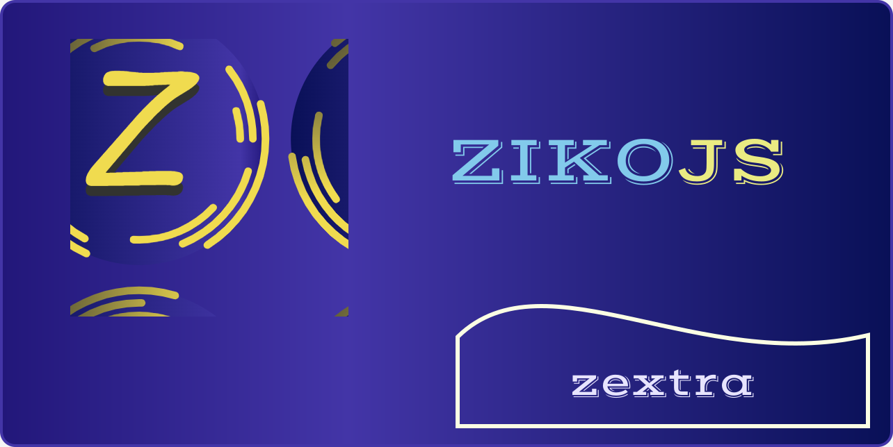

***Zextra*** is an extension for [ZikoJS](https://github.com/zakarialaoui10/zikojs) that adds extra utilities and UI components, making it easier to work with custom UI elements,

|Category|Components|
|-|-|
|Buttons|`Button` `Fab`|
|Containers|`AspectRatio` `Bleed` `Center` `Content` `Diff` `Draggable` `Paper`|
|Dialog|`Dialog` `Modal`|
|Feedback|`Alert` `Callout`|
|Inputs|`Rating` `Autocomplete`|
|Layouts|`Meny` `Splitter`|
|List||
|Logics|`QText` `QView`|
|Nav|`Breadcumbs` `Link`|
|Reveal|`Accordion` `Collapsible` `Tabs`|
|Transition|`Fade` `Grow` `Slide`|
|Typography||

